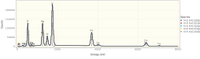
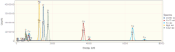
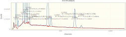
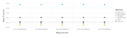
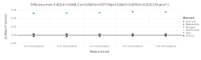
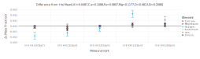

## [Quantifying K412 using NeXLSpectrum and NeXLMatrixCorrection](@id k412fits)

This document demonstrates the low-level API for filter fitting spectra.  It is more flexible than the higher-
level API but much more complex.  In most situations, the high level API discussed [here](@ref k412refs) is more appropriate.

Use the NeXLSpectrum to load, plot, fit and report the quantification of a set of K412 spectra.

Loading `NeXLSpectrum` also automatically makes `NeXLCore` and `NeXLUncertainties` available.

Loading the `Gadfly` library adds plotting support to `NeXLSpectrum`.

```julia
using NeXLSpectrum              # Provides spectrum reading and fitting tools
using NeXLMatrixCorrection      # Provides `quant` to convert k-ratios to mass fraction.
using Gadfly                    # Plotting
using DataFrames, Latexify      # Tables
```


#### Read in the Spectra
```julia
path = joinpath(@__DIR__,"K412 spectra")
# Load a single spectrum
fe = loadspectrum(joinpath(path, "Fe std.msa"))
# Create a detector model to match it
det = matching(fe, 132.0, 10)
# Now load all the spectra using this detector
unks = (i->loadspectrum(joinpath(path, "III-E K412[$i][4].msa"),det)).(0:4)
al2o3 = loadspectrum(joinpath(path, "Al2O3 std.msa"),det)
caf2 = loadspectrum(joinpath(path, "CaF2 std.msa"),det)
fe = loadspectrum(joinpath(path, "Fe std.msa"),det)
mgo = loadspectrum(joinpath(path, "MgO std.msa"),det)
sio2 = loadspectrum(joinpath(path, "SiO2 std.msa"),det)
# Add carbon coating
foreach(s->s[:Coating]=Film(pure(n"C"), 30.0e-7), unks)
foreach(s->s[:Coating]=Film(pure(n"C"), 10.0e-7), (al2o3, caf2, mgo, sio2));
```


Table: The spectra

|               Name | BeamEnergy | ProbeCurrent | LiveTime | RealTime |           Coating |  Integral | Material |
| ------------------:| ----------:| ------------:| --------:| --------:| -----------------:| ---------:| --------:|
| III-E K412[0][all] |      2e+04 |        1.114 |    235.5 |    286.3 | 30.0 nm of Pure C | 8.079e+06 |     K412 |
| III-E K412[1][all] |      2e+04 |        1.114 |    235.4 |    286.2 | 30.0 nm of Pure C | 8.077e+06 |     K412 |
| III-E K412[2][all] |      2e+04 |        1.112 |    235.5 |    286.3 | 30.0 nm of Pure C | 8.084e+06 |     K412 |
| III-E K412[3][all] |      2e+04 |         1.11 |    235.4 |    286.3 | 30.0 nm of Pure C | 8.087e+06 |     K412 |
| III-E K412[4][all] |      2e+04 |         1.11 |    235.4 |    286.2 | 30.0 nm of Pure C | 8.081e+06 |     K412 |
|          Al2O3 std |      2e+04 |         1.11 |     1172 |     1491 | 10.0 nm of Pure C | 4.974e+07 |    Al2O3 |
|           CaF2 std |      2e+04 |         1.11 |     1176 |     1456 | 10.0 nm of Pure C | 4.406e+07 |     CaF2 |
|             Fe std |      2e+04 |         1.11 |     1171 |     1529 |           nothing | 5.445e+07 |       Fe |
|            MgO std |      2e+04 |        1.106 |     1176 |     1496 | 10.0 nm of Pure C | 4.985e+07 |      MgO |
|           SiO2 std |      2e+04 |         1.11 |     1173 |     1470 | 10.0 nm of Pure C | 4.665e+07 |     SiO2 |


Notice that the spectra all have 1) live-time (`:LiveTime`); 2) probe-current (`:ProbeCurrent`); 3) take-off angle
(`:TakeOffAngle`); 4) beam energy (`:BeamEnergy`); and detector (`:Detector`) properties defined.  These properties
are necessary for extracting the k-ratios and estimating the composition.
```julia
sio2[:LiveTime], sio2[:ProbeCurrent], sio2[:TakeOffAngle], sio2[:BeamEnergy], sio2[:Detector]
```

```
(1173.1648, 1.10989, 0.6108652381980153, 20000.0, BasicEDS[4096 chs, 1.6303
2 + 9.99856⋅ch eV, 132.0 eV @ Mn K-L3, 10 ch LLD, [Be,Sc,Ba,Pu]])
```


#### The Unknowns
```julia
display(plot(unks..., klms=[n"O",n"Mg",n"Al",n"Si",n"Ca",n"Fe"], xmax=8.0e3))
```




#### The Reference Spectra
Build a convenient structure so it is easy to appreciate the necessary information and to splat it into
`filteredReference`.
```julia
refs = (
  # spectrum, element, composition
  ( al2o3, n"Al", mat"Al2O3" ), #
  ( mgo,   n"Mg", mat"MgO" ),   #
  ( fe,    n"Fe", mat"Fe" ),    #
  ( sio2,  n"Si", mat"SiO2" ),  #
  ( sio2,  n"O",  mat"SiO2" ),  #
  ( caf2,  n"Ca", mat"CaF2" ), )
display(plot(al2o3, caf2, fe, mgo, sio2, klms=collect( ref[2] for ref in refs), xmax=8.0e3))
```




#### Pre-filter the Reference Spectra
```julia
# Build a top-hat filter
filt = buildfilter(NeXLSpectrum.GaussianFilter,det)
# Filter all the reference spectra
frs = mapreduce(ref->filterreference(filt, ref..., withEsc=true), append!, refs)
# frs is now a FilteredReference[] used to fit the unknowns.
```

```
12-element Vector{FilteredReference{Float64}}:
 Reference[k[Al K-L3 + 3 others, Al2O3]]
 Reference[k[Mg K-L3 + 1 other, MgO]]
 Reference[k[Fe L3-M5 + 13 others, Fe]]
 Reference[k[Fe K-L3 + 1 other, Fe]]
 Reference[k[Fe K-M3 + 3 others, Fe]]
 Reference[Ecs[Fe K-L3 + 1 other]]
 Reference[Ecs[Fe K-M3 + 3 others]]
 Reference[k[Si K-L3 + 3 others, SiO2]]
 Reference[k[O K-L3 + 1 other, SiO2]]
 Reference[k[Ca K-L3 + 3 others, CaF2]]
 Reference[Ecs[Ca K-L3 + 1 other]]
 Reference[Ecs[Ca K-M3 + 1 other]]
```


#### Fit the Pre-Filtered References to the Unknowns
```julia
res= [ fit_spectrum(unk,filt,frs,false) for unk in unks ]
```

```
5-element Vector{FilterFitResult{Float64}}:
 FitResult(III-E K412[0][all])
 FitResult(III-E K412[1][all])
 FitResult(III-E K412[2][all])
 FitResult(III-E K412[3][all])
 FitResult(III-E K412[4][all])
```


|            Spectra | k[O K-L3 + 1 other, SiO2] | k[Fe L3-M5 + 13 others, Fe] | k[Mg K-L3 + 1 other, MgO] | k[Al K-L3 + 3 others, Al2O3] | k[Si K-L3 + 3 others, SiO2] | k[Ca K-L3 + 3 others, CaF2] | k[Fe K-L3 + 1 other, Fe] | k[Fe K-M3 + 3 others, Fe] |
| ------------------:| -------------------------:| ---------------------------:| -------------------------:| ----------------------------:| ---------------------------:| ---------------------------:| ------------------------:| -------------------------:|
| III-E K412[0][all] |                    0.6422 |                     0.03929 |                    0.1469 |                      0.06716 |                      0.3506 |                      0.1925 |                  0.06714 |                   0.06744 |
| III-E K412[1][all] |                    0.6449 |                     0.03921 |                    0.1468 |                      0.06666 |                      0.3496 |                      0.1918 |                  0.06718 |                   0.06544 |
| III-E K412[2][all] |                    0.6451 |                     0.03969 |                    0.1472 |                        0.067 |                      0.3505 |                      0.1925 |                  0.06687 |                   0.06622 |
| III-E K412[3][all] |                    0.6497 |                     0.03846 |                    0.1477 |                      0.06705 |                       0.351 |                      0.1929 |                  0.06706 |                   0.06702 |
| III-E K412[4][all] |                    0.6482 |                     0.03854 |                    0.1476 |                      0.06722 |                      0.3517 |                      0.1922 |                  0.06696 |                   0.06577 |


Let's take a look at a residual spectrum by plotting one of the `FilterFitResult` objects.
```julia
plot(res[1])
```




#### Quantify the k-ratios by Matrix Correction
```julia
quant = quantify.(res)
```

```
5-element Vector{IterationResult}:
 Converged to III-E K412[0][all][O=0.4745,Mg=0.1170,Al=0.0488,Si=0.2081,Ca=
0.1090,Fe=0.0810] in 8 steps.
 Converged to III-E K412[1][all][O=0.4754,Mg=0.1170,Al=0.0484,Si=0.2075,Ca=
0.1086,Fe=0.0811] in 8 steps.
 Converged to III-E K412[2][all][O=0.4761,Mg=0.1172,Al=0.0486,Si=0.2080,Ca=
0.1090,Fe=0.0807] in 8 steps.
 Converged to III-E K412[3][all][O=0.4788,Mg=0.1176,Al=0.0487,Si=0.2083,Ca=
0.1093,Fe=0.0809] in 9 steps.
 Converged to III-E K412[4][all][O=0.4776,Mg=0.1175,Al=0.0488,Si=0.2087,Ca=
0.1089,Fe=0.0808] in 9 steps.
```


|           Material |      O |     Mg |      Al |     Si |     Ca |      Fe | Total |
| ------------------:| ------:| ------:| -------:| ------:| ------:| -------:| -----:|
| III-E K412[0][all] | 0.4745 |  0.117 | 0.04876 | 0.2081 |  0.109 |   0.081 | 1.038 |
| III-E K412[1][all] | 0.4754 |  0.117 | 0.04842 | 0.2075 | 0.1086 | 0.08106 | 1.038 |
| III-E K412[2][all] | 0.4761 | 0.1172 | 0.04865 |  0.208 |  0.109 | 0.08069 |  1.04 |
| III-E K412[3][all] | 0.4788 | 0.1176 |  0.0487 | 0.2083 | 0.1093 | 0.08093 | 1.044 |
| III-E K412[4][all] | 0.4776 | 0.1175 | 0.04881 | 0.2087 | 0.1089 |  0.0808 | 1.042 |


Finally plot the results as mass fractions.
```julia
plot(quant, known=unks[1][:Composition])
```




Plot the difference from the SRM value.
```julia
plot(quant, known=unks[1][:Composition], delta=true)
```




Plot the difference from the mean value for each element.
```julia
plot(quant, delta=true)
```


