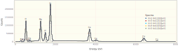
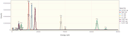
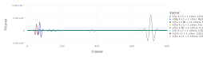
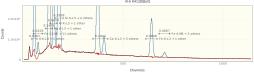
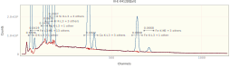

## Quick Quantifying K412 using NeXLSpectrum VectorQuant

Fred Schamber taught me this trick for quantifying spectrum extremely quickly.  It works reasonably well
for a moderate number of ROIs, particularly when few of the ROIs interfere.

Use the NeXLSpectrum to load, plot, fit and report the quantification of a set of K412 spectra.

Loading `NeXLSpectrum` also automatically makes `NeXLCore` and `NeXLUncertainties` available.

Loading the `Gadfly` library adds plotting support to `NeXLSpectrum`.

```julia
using NeXLSpectrum              # Provides spectrum reading and fitting tools
using NeXLMatrixCorrection      # Provides `quant` to convert k-ratios to mass fraction.
using Gadfly                    # Plotting
using DataFrames, Latexify      # Tables
```


#### Read in the Spectra
```julia
path = joinpath(@__DIR__, "K412 spectra")
# Load the unknowns 
unks = map(0:4) do i
  loadspectrum(joinpath(path, "III-E K412[$i][4].msa"))
end
# Create a detector model to match the unknown spectra
det = matching(unks[1], 132.0, 10)
```

```
BasicEDS[4096 chs, 1.63032 + 9.99856⋅ch eV, 132.0 eV @ Mn K-L3, 10 ch LLD, 
[Be,Sc,Ba,Pu]]
```


|               Name | BeamEnergy | ProbeCurrent | LiveTime | RealTime | Coating |  Integral | Material |
| ------------------:| ----------:| ------------:| --------:| --------:| -------:| ---------:| --------:|
| III-E K412[0][all] |      2e+04 |        1.114 |    235.5 |    286.3 | nothing |  8.08e+06 |     K412 |
| III-E K412[1][all] |      2e+04 |        1.114 |    235.4 |    286.2 | nothing | 8.077e+06 |     K412 |
| III-E K412[2][all] |      2e+04 |        1.112 |    235.5 |    286.3 | nothing | 8.084e+06 |     K412 |
| III-E K412[3][all] |      2e+04 |         1.11 |    235.4 |    286.3 | nothing | 8.087e+06 |     K412 |
| III-E K412[4][all] |      2e+04 |         1.11 |    235.4 |    286.2 | nothing | 8.081e+06 |     K412 |


Notice that the spectra all have 1) live-time (`:LiveTime`); 2) probe-current (`:ProbeCurrent`); 3) take-off angle
(`:TakeOffAngle`); 4) beam energy (`:BeamEnergy`); and detector (`:Detector`) properties defined.  These properties
are necessary for extracting the k-ratios and estimating the composition.
```julia
unks[1][:LiveTime], unks[1][:ProbeCurrent], unks[1][:TakeOffAngle], unks[1][:BeamEnergy]
```

```
(235.48403, 1.11355, 0.6108652381980153, 20000.0)
```


#### The Unknowns
```julia
display(plot(unks..., klms=[n"O",n"Mg",n"Al",n"Si",n"Ca",n"Fe"], xmax=8.0e3))
```




#### The Reference Spectra
Build a convenient structure so it is easy to appreciate the necessary information and to splat it into
`filteredReference`.
```julia
ffrs = references( [
  reference(n"Al", joinpath(path, "Al2O3 std.msa"), mat"Al2O3" ), #
  reference(n"Mg", joinpath(path, "MgO std.msa"), mat"MgO" ),   #
  reference(n"Fe", joinpath(path, "Fe std.msa"), mat"Fe" ),    #
  reference(n"Si", joinpath(path, "SiO2 std.msa"), mat"SiO2" ),  #
  reference(n"O", joinpath(path, "SiO2 std.msa"), mat"SiO2" ),  #
  reference(n"Ca", joinpath(path, "CaF2 std.msa"), mat"CaF2" ) 
], det)
display(plot( spectra(ffrs)..., klms= [n"O",n"Mg",n"Al",n"Si",n"Ca",n"Fe"], xmax=8.0e3))
```




#### Filter the Reference Spectra and Compute the VectorQuant Structure
```julia
vq = VectorQuant(ffrs)
plot(vq, 1:800)
```




Let's take a look at a residual spectrum by plotting one of the `FilterFitResult` objects.
Perform the fit and look at the residual
```julia
res = map(unks) do unk
  fit_spectrum(unk, vq)
end
plot(res[1])
```




#### Compare this with the weighted fit
```julia
resfull = map(unks) do unk
  fit_spectrum(unk, ffrs)
end
plot(resfull[1])
```




Now the full data set...

|            Spectra | k[O K-L3 + 1 other, SiO2] | Δk[O K-L3 + 1 other, SiO2] | k[Fe L3-M5 + 13 others, Fe] | Δk[Fe L3-M5 + 13 others, Fe] | k[Mg K-L3 + 1 other, MgO] | Δk[Mg K-L3 + 1 other, MgO] | k[Al K-L3 + 3 others, Al2O3] | Δk[Al K-L3 + 3 others, Al2O3] | k[Si K-L3 + 3 others, SiO2] | Δk[Si K-L3 + 3 others, SiO2] | k[Ca K-L3 + 3 others, CaF2] | Δk[Ca K-L3 + 3 others, CaF2] | k[Fe K-L3 + 1 other, Fe] | Δk[Fe K-L3 + 1 other, Fe] | k[Fe K-M3 + 3 others, Fe] | Δk[Fe K-M3 + 3 others, Fe] |
| ------------------:| -------------------------:| --------------------------:| ---------------------------:| ----------------------------:| -------------------------:| --------------------------:| ----------------------------:| -----------------------------:| ---------------------------:| ----------------------------:| ---------------------------:| ----------------------------:| ------------------------:| -------------------------:| -------------------------:| --------------------------:|
| III-E K412[0][all] |                     0.646 |                  0.0007025 |                     0.04247 |                    0.0001609 |                    0.1473 |                  0.0001513 |                       0.0669 |                      0.000103 |                      0.3508 |                    0.0002465 |                      0.1922 |                    0.0001964 |                  0.06683 |                 0.0001282 |                   0.06666 |                  0.0003453 |
| III-E K412[1][all] |                     0.648 |                  0.0007037 |                     0.04215 |                    0.0001603 |                    0.1472 |                  0.0001513 |                       0.0667 |                     0.0001029 |                      0.3499 |                    0.0002462 |                      0.1916 |                    0.0001961 |                  0.06701 |                 0.0001284 |                   0.06714 |                  0.0003466 |
| III-E K412[2][all] |                    0.6485 |                  0.0007045 |                     0.04243 |                     0.000161 |                    0.1477 |                  0.0001516 |                      0.06701 |                     0.0001032 |                       0.351 |                    0.0002468 |                      0.1922 |                    0.0001966 |                  0.06683 |                 0.0001283 |                   0.06683 |                   0.000346 |
| III-E K412[3][all] |                     0.653 |                  0.0007075 |                     0.04192 |                    0.0001601 |                    0.1479 |                  0.0001519 |                      0.06708 |                     0.0001033 |                      0.3518 |                    0.0002473 |                      0.1926 |                     0.000197 |                  0.06684 |                 0.0001284 |                   0.06759 |                  0.0003483 |
| III-E K412[4][all] |                    0.6514 |                  0.0007067 |                      0.0415 |                    0.0001593 |                    0.1479 |                  0.0001519 |                      0.06722 |                     0.0001035 |                      0.3518 |                    0.0002473 |                       0.192 |                    0.0001967 |                  0.06687 |                 0.0001285 |                   0.06634 |                  0.0003451 |


|            Spectra | k[O K-L3 + 1 other, SiO2] | Δk[O K-L3 + 1 other, SiO2] | k[Fe L3-M5 + 13 others, Fe] | Δk[Fe L3-M5 + 13 others, Fe] | k[Mg K-L3 + 1 other, MgO] | Δk[Mg K-L3 + 1 other, MgO] | k[Al K-L3 + 3 others, Al2O3] | Δk[Al K-L3 + 3 others, Al2O3] | k[Si K-L3 + 3 others, SiO2] | Δk[Si K-L3 + 3 others, SiO2] | k[Ca K-L3 + 3 others, CaF2] | Δk[Ca K-L3 + 3 others, CaF2] | k[Fe K-L3 + 1 other, Fe] | Δk[Fe K-L3 + 1 other, Fe] | k[Fe K-M3 + 3 others, Fe] | Δk[Fe K-M3 + 3 others, Fe] |
| ------------------:| -------------------------:| --------------------------:| ---------------------------:| ----------------------------:| -------------------------:| --------------------------:| ----------------------------:| -----------------------------:| ---------------------------:| ----------------------------:| ---------------------------:| ----------------------------:| ------------------------:| -------------------------:| -------------------------:| --------------------------:|
| III-E K412[0][all] |                    0.6536 |                  0.0008101 |                     0.04191 |                    0.0004382 |                    0.1476 |                  0.0001834 |                      0.06699 |                     0.0001589 |                      0.3507 |                    0.0002889 |                      0.1922 |                    0.0002326 |                  0.06683 |                 0.0001593 |                   0.06684 |                  0.0006722 |
| III-E K412[1][all] |                    0.6554 |                  0.0008108 |                     0.04156 |                    0.0004372 |                    0.1475 |                  0.0001835 |                      0.06675 |                      0.000159 |                      0.3499 |                    0.0002888 |                      0.1916 |                    0.0002325 |                  0.06708 |                 0.0001595 |                   0.06738 |                  0.0006721 |
| III-E K412[2][all] |                     0.656 |                  0.0008124 |                     0.04191 |                    0.0004381 |                    0.1479 |                  0.0001838 |                      0.06709 |                     0.0001594 |                      0.3511 |                    0.0002896 |                      0.1922 |                    0.0002329 |                  0.06688 |                 0.0001596 |                   0.06704 |                  0.0006737 |
| III-E K412[3][all] |                    0.6604 |                  0.0008155 |                     0.04146 |                     0.000438 |                    0.1481 |                  0.0001841 |                      0.06716 |                     0.0001595 |                      0.3519 |                      0.00029 |                      0.1925 |                    0.0002333 |                  0.06682 |                 0.0001598 |                    0.0678 |                  0.0006746 |
| III-E K412[4][all] |                    0.6588 |                  0.0008149 |                     0.04081 |                    0.0004383 |                    0.1482 |                  0.0001841 |                      0.06728 |                     0.0001597 |                      0.3518 |                      0.00029 |                      0.1922 |                    0.0002333 |                  0.06694 |                 0.0001598 |                   0.06648 |                   0.000674 |


Compare the timings (full then fast)
```julia
using BenchmarkTools
@btime map(unk->fit_spectrum(unk, ffrs), unks)
@btime map(unk->fit_spectrum(unk, vq), unks)
```

```
1.422 ms (2847 allocations: 1.28 MiB)
  404.500 μs (667 allocations: 191.23 KiB)
5-element Vector{FilterFitResult{Float64}}:
 FitResult(III-E K412[0][all])
 FitResult(III-E K412[1][all])
 FitResult(III-E K412[2][all])
 FitResult(III-E K412[3][all])
 FitResult(III-E K412[4][all])
```


