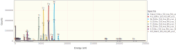
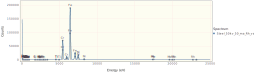
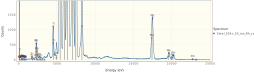
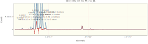

# Fitting a Stainless Steel XRF Spectrum
Load the necessary libraries.

```julia
using NeXLSpectrum
using Gadfly           # For plotting. I've added spectrum support.
using DataFrames, Latexify       # For tables.
```


Load the spectra from EMSA files.
```julia
path = joinpath(@__DIR__, "XRF Stainless")
# We use map to apply `readEMSA` to each of the files
specs = steel, fe, ni, cr, ti, si, s, sn = map(fn->loadspectrum(joinpath(path, fn)), (
  "Steel_50kv_50_ma_Rh_vac_D1.msa",
  "Fe_50kv_50_ma_Rh_vac_D1.msa",
  "Ni_50kv_50_ma_Rh_vac_D1.msa",
  "Cr_50kv_50_ma_Rh_vac_D1.msa",
  "Ti_50kv_50_ma_Rh_vac_D1.msa",
  "Si_50kv_50_ma_Rh_vac_D1.msa",
  "S_50kv_50_ma_Rh_vac_D1.msa",
  "Sn_50kv_50_ma_Rh_vac_D1.msa",));
```


|                       Name | BeamEnergy | ProbeCurrent | LiveTime | RealTime | Coating |  Integral | Material |
| --------------------------:| ----------:| ------------:| --------:| --------:| -------:| ---------:| --------:|
| Steel*50kv*50*ma*Rh*vac*D1 |    missing |      missing |      120 |    131.9 | nothing | 6.536e+06 |  missing |
|    Fe*50kv*50*ma*Rh*vac*D1 |    missing |      missing |      120 |    134.8 | nothing | 7.644e+06 |  missing |
|    Ni*50kv*50*ma*Rh*vac*D1 |    missing |      missing |      120 |    137.7 | nothing | 8.487e+06 |  missing |
|    Cr*50kv*50*ma*Rh*vac*D1 |    missing |      missing |      120 |    131.7 | nothing | 6.578e+06 |  missing |
|    Ti*50kv*50*ma*Rh*vac*D1 |    missing |      missing |      120 |      128 | nothing | 5.087e+06 |  missing |
|    Si*50kv*50*ma*Rh*vac*D1 |    missing |      missing |      120 |      121 | nothing | 1.862e+06 |  missing |
|     S*50kv*50*ma*Rh*vac*D1 |    missing |      missing |      120 |    122.2 | nothing | 2.455e+06 |  missing |
|    Sn*50kv*50*ma*Rh*vac*D1 |    missing |      missing |      120 |    121.5 | nothing | 2.099e+06 |  missing |


```julia
plot(specs..., xmax=25.0e3,klms=[n"Fe",n"Cr",n"Ni",n"Ti", n"Si",n"S", n"Mo", n"Rh"])
```



```julia
display(plot(steel,xmax=25.0e3, yscale=1.1,klms=[n"Fe",n"Cr",n"Ni",n"Ti", n"Si",n"S", n"Mo", n"Rh"]))
display(plot(steel,xmax=25.0e3, yscale=0.01,klms=[n"Fe",n"Cr",n"Ni",n"Ti", n"Si",n"S", n"Mo", n"Rh"]))
```





Build the filtered references which will be fit to the steel unknown.
```julia
# This Dict defines which is the lowest z element which can be measured for the K, L, M, N shells
firstelm = Dict(KShell=>n"Na", LShell=>n"Zn", MShell=>n"Sm", NShell=>n"Og")
# Build a detector to match the steel spectrum
det = matching(steel, steel[:FWHMMnKa], 120, firstelm)
# Build a 'VariableWidthFilter' top-hat filter to suit the detector
filt = buildfilter(VariableWidthFilter,det)
refdata = (
  # ( spectrum, element, material ), # The ordering of `refdata` allows us to splat it into `filterreference(...)`
  ( fe, n"Fe", mat"Fe" ),
  ( cr, n"Cr", mat"Cr" ),
  ( ni, n"Ni", mat"Ni" ),
  ( ti, n"Ti", mat"Ti" ),
  ( si, n"Si", mat"Si" ),
  ( s, n"S", mat"S" ),
  ( sn, n"Sn", mat"Sn" ),
)
# Some necessary properties are missing from the spectra so provide them.
xtra = Dict{Symbol,Any}(:BeamEnergy=>40.0e3, :ProbeCurrent=>1.0, :Detector=>det)
refs = FilteredReference[]
for rd in refdata
  append!(refs, filterreference(filt, rd..., props=xtra))
end
# Merge the missing properties into the unknown too.
merge!(steel, xtra)
res = fit_spectrum(steel, filt, refs, false)
# Tabulate the results
```

```
Steel_50kv_50_ma_Rh_vac_D1
```


|                   Spectrum |                     Feature |               Reference | Start | Stop |          K |        dK |      Peak |      Back |      PtoB |
| --------------------------:| ---------------------------:| -----------------------:| -----:| ----:| ----------:| ---------:| ---------:| ---------:| ---------:|
| Steel*50kv*50*ma*Rh*vac*D1 |   k[Cr K-L3 + 5 others, Cr] | Cr*50kv*50*ma*Rh*vac*D1 |   609 |  717 |     0.2356 | 0.0002151 | 1.281e+06 | 5.179e+04 |      2672 |
| Steel*50kv*50*ma*Rh*vac*D1 |    k[Fe K-L3 + 1 other, Fe] | Fe*50kv*50*ma*Rh*vac*D1 |   706 |  767 |      0.557 | 0.0003218 |  3.05e+06 | 1.555e+04 | 1.196e+04 |
| Steel*50kv*50*ma*Rh*vac*D1 |   k[Fe K-M3 + 3 others, Fe] | Fe*50kv*50*ma*Rh*vac*D1 |   774 |  830 |     0.5712 |  0.001038 | 4.858e+05 | 3.219e+04 |     845.1 |
| Steel*50kv*50*ma*Rh*vac*D1 |    k[Ni K-L3 + 1 other, Ni] | Ni*50kv*50*ma*Rh*vac*D1 |   811 |  876 |     0.0488 | 0.0001035 | 3.495e+05 | 5.005e+04 |     453.9 |
| Steel*50kv*50*ma*Rh*vac*D1 |   k[Ni K-M3 + 3 others, Ni] | Ni*50kv*50*ma*Rh*vac*D1 |   893 |  953 |    0.04948 | 0.0003118 | 6.067e+04 | 1.667e+04 |     218.4 |
| Steel*50kv*50*ma*Rh*vac*D1 |     k[S K-L3 + 3 others, S] |  S*50kv*50*ma*Rh*vac*D1 |   305 |  362 |   0.005651 |  0.000116 | 1.243e+04 |      6633 |     106.8 |
| Steel*50kv*50*ma*Rh*vac*D1 |   k[Si K-L3 + 2 others, Si] | Si*50kv*50*ma*Rh*vac*D1 |   249 |  296 |   0.002306 | 0.0001139 |      2510 |      1536 |     76.78 |
| Steel*50kv*50*ma*Rh*vac*D1 |    k[Sn K-L3 + 1 other, Sn] | Sn*50kv*50*ma*Rh*vac*D1 |  2549 | 2677 |   -1.2e-05 |  0.001518 |       205 |     205.2 |     127.8 |
| Steel*50kv*50*ma*Rh*vac*D1 |   k[Sn K-M3 + 7 others, Sn] | Sn*50kv*50*ma*Rh*vac*D1 |  2891 | 3055 |  -0.001964 |  0.006831 |       113 |     118.9 |     155.8 |
| Steel*50kv*50*ma*Rh*vac*D1 | k[Sn L3-M5 + 23 others, Sn] | Sn*50kv*50*ma*Rh*vac*D1 |   380 |  555 | -2.329e-05 | 0.0001948 | 3.086e+04 | 3.088e+04 |     174.9 |
| Steel*50kv*50*ma*Rh*vac*D1 |   k[Ti K-L3 + 3 others, Ti] | Ti*50kv*50*ma*Rh*vac*D1 |   520 |  614 |   0.004754 | 4.536e-05 | 3.347e+04 | 1.584e+04 |     198.6 |


Plot the residual spectrum.  Note that Mo and Rh were not fit and so there remain significant peaks between 16 and
20 keV.
```julia
plot(res)
```


