## Modeling the Continuum
Nicholas W. M. Ritchie 9-Jun-2020

Modeling the continuum (Bremsstrahlung) is a necessary component of being able to perform an straight (unfiltered)
spectrum fit.  These models can either be used to handle the continuum for linear or non-linear spectrum fits.

```julia
using NeXLSpectrum
using NeXLMatrixCorrection
using Gadfly
using Colors
```


The `ContinuumModel` handles the generation of Bremsstrahlung within the sample, the absorption of the generated
X-rays as they exit the sample and the efficiency of the detector collecting the X-rays.
```julia
e0 = 15.0e3
eff = SDDEfficiency(TabulatedWindow(MoxtekAP33()); thickness=0.0370, deadlayer=30.0e-7, entrance=Film(pure(n"Al"), 10.0e-7))
#eff = SDDEfficiency(NoWindow(); thickness=100.0, deadlayer=0.0e-7, entrance=Film(pure(n"Al"), 0.0e-7))
cmod = ContinuumModel(mat"0.8*Fe+0.15*Cr+0.05*Ni", e0, deg2rad(40.0))
plot([ea->emitted(cmod, ea),ea->generated(cmod, ea)],100.0,e0)
```

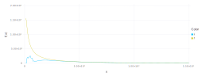

```julia
e0 = 5.0e3
cmod = ContinuumModel(mat"SiO2", e0, deg2rad(40.0))
plot([ea->emitted(cmod, ea),ea->generated(cmod, ea)],100.0,e0)
```

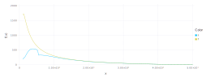

```julia
det = simpleEDS(4096, 5.0, 0.0, 132.0, 10)
e0 = 5.0e3
cmod = ContinuumModel(mat"0.8*Fe+0.15*Cr+0.05*Ni", e0, deg2rad(40.0))
resp = NeXLSpectrum.detectorresponse(det, eff)
emt = map(ch->ch>=lld(det) ? emitted(cmod,energy(ch,det)) : 0.0,1:channelcount(det))
meas =  resp*emt
lyrs = [ layer(x=energyscale(det), y=emt, Geom.line, Theme(default_color="red")), layer(x=energyscale(det), y=meas, Geom.line) ]
plot(lyrs..., Coord.cartesian(xmin=0, xmax=e0))
```

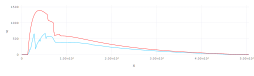


## Models!!!
```julia
model, mc = Castellano2004a, Riveros1993
eff = SDDEfficiency(TabulatedWindow(MoxtekAP33()); thickness=0.0370, deadlayer=30.0e-7, entrance=Film(pure(n"Al"), 10.0e-7))

spec = loadspectrum(joinpath(@__DIR__, "K412 spectra","III-E K412[0][4].msa"))
det=matching(spec, 132.0, 10)
roi = channel(4.5e3,det):channel(6.0e3,det)

spec = loadspectrum(joinpath(@__DIR__, "K412 spectra","III-E K412[0][4].msa"))
cmod = ContinuumModel(spec[:Composition], spec[:BeamEnergy], spec[:TakeOffAngle], bremsstrahlung=model)
emt = map(ch->ch>=lld(det) ? emitted(cmod,energy(ch,det)) : 0.0,1:channelcount(det))
resp = NeXLSpectrum.detectorresponse(det, eff)
meas = resp*emt

plot(layer(x=eachindex(emt),y=emt, Geom.line),layer(x=eachindex(meas),y=meas, Geom.point))
```

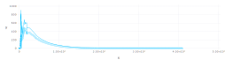

```julia
spec = loadspectrum(joinpath(@__DIR__, "K412 spectra","III-E K412[0][4].msa"))
brem = fitcontinuum(spec, resp, [roi], brem=model, mc=mc)
println("k = $(brem[:K]/dose(spec))")

plot(spec, brem, yscale=0.05, xmax=12.0e3)
```

```
k = 0.00036228012968445033
```


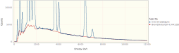

```julia
spec = loadspectrum(joinpath(@__DIR__, "K412 spectra","Al2O3 std.msa"))
brem = fitcontinuum(spec, resp, [roi], brem=model, mc=mc)
println("k = $(brem[:K]/dose(spec))")
plot(spec, brem, yscale=0.01, xmax=8.0e3)
```

```
k = 1.589605883279797e-5
```


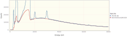

```julia
spec = loadspectrum(joinpath(@__DIR__, "K412 spectra","SiO2 std.msa"))
brem = fitcontinuum(spec, resp, [roi], brem=model, mc=mc)
println("k = $(brem[:K]/dose(spec))")
plot(spec, brem, yscale=0.01, xmax=8.0e3)
```

```
k = 1.596966709142019e-5
```


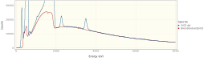

```julia
spec = loadspectrum(joinpath(@__DIR__, "K412 spectra","MgO std.msa"))
brem = fitcontinuum(spec, resp, [roi], brem=model, mc=mc)
println("k = $(brem[:K]/dose(spec))")
plot(spec, brem, yscale=0.01, xmax=8.0e3)
```

```
k = 1.5829277549626298e-5
```


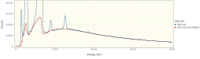

```julia
spec = loadspectrum(joinpath(@__DIR__, "K412 spectra","CaF2 std.msa"))
brem = fitcontinuum(spec, resp, [roi], brem=model, mc=mc)
println("k = $(brem[:K]/dose(spec))")
plot(spec, brem, yscale=0.05, xmax=8.0e3)
```

```
k = 1.513254100130786e-5
```


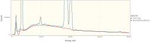

```julia
spec = loadspectrum(joinpath(@__DIR__, "K412 spectra","Fe std.msa"))
brem = fitcontinuum(spec, resp, [ channel(2.0e3,det):channel(4.0e3,det)], brem=model, mc=mc)
println("k = $(brem[:K]/dose(spec))")
plot(spec, brem, yscale=0.05, xmax=8.0e3)
```

```
k = 1.796887828500161e-5
```


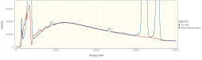

```julia
path = joinpath(@__DIR__,"K412 spectra")
spec = loadspectrum(joinpath(path,"III-E K412[0][4].msa"))
display(plot(spec, subtractcontinuum(spec, det, resp), yscale=0.05, xmax=8.0e3))

spec = loadspectrum(joinpath(path,"Al2O3 std.msa"))
display(plot(spec, subtractcontinuum(spec, det, resp), yscale=0.05, xmax=8.0e3))

spec = loadspectrum(joinpath(path,"SiO2 std.msa"))
display(plot(spec, subtractcontinuum(spec, det, resp), yscale=0.05, xmax=8.0e3))

spec = loadspectrum(joinpath(path,"MgO std.msa"))
display(plot(spec, subtractcontinuum(spec, det, resp), yscale=0.05, xmax=8.0e3))

spec = loadspectrum(joinpath(path,"CaF2 std.msa"))
display(plot(spec, subtractcontinuum(spec, det, resp), yscale=0.05, xmax=8.0e3))

spec = loadspectrum(joinpath(path,"Fe std.msa"))
display(plot(spec, subtractcontinuum(spec, det, resp), yscale=0.05, xmax=8.0e3))

spec = loadspectrum(joinpath(@__DIR__, "spectra","Ag std.msa"))
display(plot(spec, fittedcontinuum(spec, det, resp, mode=:Global), fittedcontinuum(spec, det, resp, mode=:Local), yscale=0.05))

spec = loadspectrum(joinpath(@__DIR__, "spectra","Au std.msa"))
display(plot(spec, fittedcontinuum(spec, det, resp, mode=:Global), fittedcontinuum(spec, det, resp, mode=:Local), yscale=0.05))

spec = loadspectrum(joinpath(@__DIR__, "spectra","B std.msa"))
display(plot(spec, fittedcontinuum(spec, det, resp, mode=:Global), fittedcontinuum(spec, det, resp, mode=:Local), yscale=0.5))

spec = loadspectrum(joinpath(@__DIR__, "spectra","Bi std.msa"))
display(plot(spec, fittedcontinuum(spec, det, resp, mode=:Global), fittedcontinuum(spec, det, resp, mode=:Local), yscale=0.05))

spec = loadspectrum(joinpath(@__DIR__, "spectra","BN std.msa"))
display(plot(spec, fittedcontinuum(spec, det, resp, mode=:Global), fittedcontinuum(spec, det, resp, mode=:Local), yscale=0.20))

spec = loadspectrum(joinpath(@__DIR__, "spectra","C std.msa"))
display(plot(spec, fittedcontinuum(spec, det, resp, mode=:Global), fittedcontinuum(spec, det, resp, mode=:Local), yscale=0.05))
```

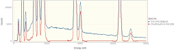


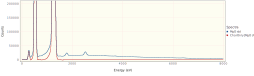
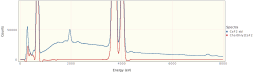

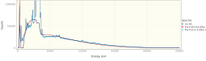
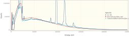
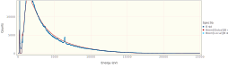
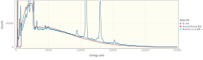
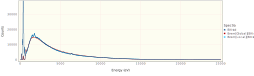
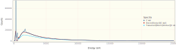
