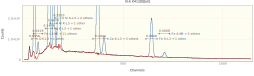
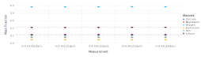

## [Quantifying K412 using NeXLSpectrum and NeXLMatrixCorrection](@id k412refs)

This document demonstrates the high-level API for filter fitting spectra.  This API is less flexible than
the low-level API discussed [here](@ref k412fits).

#### Libraries
Use the NeXLSpectrum to load, plot, fit and report the quantification of a set of K412 spectra.

Loading `NeXLSpectrum` also automatically makes `NeXLCore` and `NeXLUncertainties` available.

Loading the `Gadfly` library adds plotting support to `NeXLSpectrum`.

```julia
using NeXLSpectrum              # Provides spectrum reading and fitting tools
using NeXLMatrixCorrection      # Provides `quant` to convert k-ratios to mass fraction.
using Gadfly                    # Plotting
using DataFrames, Latexify      # Tables
```


#### The `reference` and `references` functions
Use the `reference` and `references` functions to build the filtered references.
```julia
# Where to find the files relative to this script file.
path = joinpath(@__DIR__, "K412 spectra")

refs = references(
  [
    # Specify a reference for iron (arg 1), in "Fe std.msa" (arg2) that is pure iron (arg3).
    reference(n"Fe", joinpath(path, "Fe std.msa"), mat"Fe"),
    # specify a conductive surface coating layer using the `coating` named argument
    reference(n"Si", joinpath(path, "SiO2 std.msa"), mat"SiO2", coating = Film(pure(n"C"), 10.0e-7)),
    reference(n"O", joinpath(path, "SiO2 std.msa"), mat"SiO2", coating = Film(pure(n"C"), 10.0e-7)),
    reference(n"Ca", joinpath(path, "CaF2 std.msa"), mat"CaF2", coating = Film(pure(n"C"), 10.0e-7)),
    # Read the composition from the spectrum file's ##D2STDCMP tag
    reference(n"Mg", joinpath(path, "MgO std.msa"), coating = Film(pure(n"C"), 10.0e-7)),
    # Read the conductive coating from the spectrum file's ##CONDCOATING tag
    reference(n"Al", joinpath(path, "Al2O3 std.msa"), mat"Al2O3"),
  ],
  132.0  # Detector resolution at Mn Kα (eV)
)
```

```
References[
	BasicEDS[4096 chs, 1.63032 + 9.99856⋅ch eV, 132.0 eV @ Mn K-L3, 1 ch LLD, 
[Be,Sc,Ba,Pu]], 
	k[Fe L3-M5 + 13 others, Fe],
	k[Fe K-L3 + 1 other, Fe],
	k[Fe K-M3 + 3 others, Fe],
	k[Si K-L3 + 3 others, SiO2],
	k[O K-L3 + 1 other, SiO2],
	k[Ca K-L3 + 3 others, CaF2],
	k[Mg K-L3 + 1 other, MgO],
	k[Al K-L3 + 3 others, Al2O3],
]
```


#### Load the Unknowns
```julia
# Now load all the unknown spectra and assign a carbon coating`
unks = map(0:4) do i 
    s = loadspectrum(joinpath(path, "III-E K412[$i][4].msa"))
    # assign a carbon coating
    s[:Coating] = Film(pure(n"C"), 30.0e-7)
    s
end
```

```
5-element Vector{Spectrum{Float64}}:
 Spectrum{Float64}[III-E K412[0][all], 1.63032 + 9.99856⋅ch eV, 4096 ch, 20
.0 keV, K412, 8.08e6 counts]
 Spectrum{Float64}[III-E K412[1][all], 1.63032 + 9.99856⋅ch eV, 4096 ch, 20
.0 keV, K412, 8.08e6 counts]
 Spectrum{Float64}[III-E K412[2][all], 1.63032 + 9.99856⋅ch eV, 4096 ch, 20
.0 keV, K412, 8.08e6 counts]
 Spectrum{Float64}[III-E K412[3][all], 1.63032 + 9.99856⋅ch eV, 4096 ch, 20
.0 keV, K412, 8.09e6 counts]
 Spectrum{Float64}[III-E K412[4][all], 1.63032 + 9.99856⋅ch eV, 4096 ch, 20
.0 keV, K412, 8.08e6 counts]
```


Table: The spectra

|               Name | BeamEnergy | ProbeCurrent | LiveTime | RealTime |                Coating |  Integral | Material |
| ------------------:| ----------:| ------------:| --------:| --------:| ----------------------:| ---------:| --------:|
| III-E K412[0][all] |      2e+04 |        1.114 |    235.5 |    286.3 |      30.0 nm of Pure C |  8.08e+06 |     K412 |
| III-E K412[1][all] |      2e+04 |        1.114 |    235.4 |    286.2 |      30.0 nm of Pure C | 8.077e+06 |     K412 |
| III-E K412[2][all] |      2e+04 |        1.112 |    235.5 |    286.3 |      30.0 nm of Pure C | 8.084e+06 |     K412 |
| III-E K412[3][all] |      2e+04 |         1.11 |    235.4 |    286.3 |      30.0 nm of Pure C | 8.087e+06 |     K412 |
| III-E K412[4][all] |      2e+04 |         1.11 |    235.4 |    286.2 |      30.0 nm of Pure C | 8.081e+06 |     K412 |
|             Fe std |      2e+04 |         1.11 |     1171 |     1529 |                nothing | 5.445e+07 |       Fe |
|             Fe std |      2e+04 |         1.11 |     1171 |     1529 |                nothing | 5.445e+07 |       Fe |
|             Fe std |      2e+04 |         1.11 |     1171 |     1529 |                nothing | 5.445e+07 |       Fe |
|           SiO2 std |      2e+04 |         1.11 |     1173 |     1470 |      10.0 nm of Pure C | 4.665e+07 |     SiO2 |
|           SiO2 std |      2e+04 |         1.11 |     1173 |     1470 |      10.0 nm of Pure C | 4.665e+07 |     SiO2 |
|           CaF2 std |      2e+04 |         1.11 |     1176 |     1456 |      10.0 nm of Pure C | 4.406e+07 |     CaF2 |
|            MgO std |      2e+04 |        1.106 |     1176 |     1496 |      10.0 nm of Pure C | 4.985e+07 |      MgO |
|          Al2O3 std |      2e+04 |         1.11 |     1172 |     1491 | 10.0 nm of Pure Carbon | 4.974e+07 |    Al2O3 |


Notice that the spectra all have 1) live-time (`:LiveTime`); 2) probe-current (`:ProbeCurrent`); 3) take-off angle
(`:TakeOffAngle`); 4) beam energy (`:BeamEnergy`); and detector (`:Detector`) properties defined.  These properties
are necessary for extracting the k-ratios and estimating the composition.
```julia
u=unks[1]
u[:LiveTime], u[:ProbeCurrent], u[:TakeOffAngle], u[:BeamEnergy], u[:Coating]
```

```
(235.48403, 1.11355, 0.6108652381980153, 20000.0, 30.0 nm of Pure C)
```


#### The Unknowns
```julia
display(plot(unks..., klms=[n"O",n"Mg",n"Al",n"Si",n"Ca",n"Fe"], xmax=8.0e3))
```


#### The Reference Spectra
Plot the reference spectra...
```julia
plot(spectra(refs)..., klms=collect(elms(refs)), xmax=8.0e3)
```


#### Fit the Pre-Filtered References to the Unknowns
```julia
res= [ fit_spectrum(u,refs) for u in unks ]
```

```
5-element Vector{FilterFitResult{Float64}}:
 FitResult(III-E K412[0][all])
 FitResult(III-E K412[1][all])
 FitResult(III-E K412[2][all])
 FitResult(III-E K412[3][all])
 FitResult(III-E K412[4][all])
```


|            Spectra | k[O K-L3 + 1 other, SiO2] | k[Fe L3-M5 + 13 others, Fe] | k[Mg K-L3 + 1 other, MgO] | k[Al K-L3 + 3 others, Al2O3] | k[Si K-L3 + 3 others, SiO2] | k[Ca K-L3 + 3 others, CaF2] | k[Fe K-L3 + 1 other, Fe] | k[Fe K-M3 + 3 others, Fe] |
| ------------------:| -------------------------:| ---------------------------:| -------------------------:| ----------------------------:| ---------------------------:| ---------------------------:| ------------------------:| -------------------------:|
| III-E K412[0][all] |                    0.6536 |                     0.04191 |                    0.1476 |                      0.06699 |                      0.3507 |                      0.1922 |                  0.06683 |                   0.06684 |
| III-E K412[1][all] |                    0.6554 |                     0.04156 |                    0.1475 |                      0.06675 |                      0.3499 |                      0.1916 |                  0.06708 |                   0.06738 |
| III-E K412[2][all] |                     0.656 |                     0.04191 |                    0.1479 |                      0.06709 |                      0.3511 |                      0.1922 |                  0.06688 |                   0.06704 |
| III-E K412[3][all] |                    0.6604 |                     0.04146 |                    0.1481 |                      0.06716 |                      0.3519 |                      0.1925 |                  0.06682 |                    0.0678 |
| III-E K412[4][all] |                    0.6588 |                     0.04081 |                    0.1482 |                      0.06728 |                      0.3518 |                      0.1922 |                  0.06694 |                   0.06648 |


Let's take a look at a residual spectrum by plotting one of the `FilterFitResult` objects.
```julia
plot(res[1])
```




#### Quantify the k-ratios by Matrix Correction
```julia
quant = quantify.(res)
```

```
5-element Vector{IterationResult}:
 Converged to III-E K412[0][all][O=0.4805,Mg=0.1176,Al=0.0487,Si=0.2081,Ca=
0.1089,Fe=0.0806] in 9 steps.
 Converged to III-E K412[1][all][O=0.4809,Mg=0.1176,Al=0.0485,Si=0.2077,Ca=
0.1085,Fe=0.0810] in 8 steps.
 Converged to III-E K412[2][all][O=0.4818,Mg=0.1179,Al=0.0487,Si=0.2084,Ca=
0.1089,Fe=0.0807] in 9 steps.
 Converged to III-E K412[3][all][O=0.4844,Mg=0.1180,Al=0.0488,Si=0.2088,Ca=
0.1090,Fe=0.0807] in 8 steps.
 Converged to III-E K412[4][all][O=0.4833,Mg=0.1181,Al=0.0489,Si=0.2088,Ca=
0.1089,Fe=0.0808] in 8 steps.
```


|           Material |      O |     Mg |      Al |     Si |     Ca |      Fe | Total |
| ------------------:| ------:| ------:| -------:| ------:| ------:| -------:| -----:|
| III-E K412[0][all] | 0.4805 | 0.1176 | 0.04865 | 0.2081 | 0.1089 | 0.08065 | 1.044 |
| III-E K412[1][all] | 0.4809 | 0.1176 |  0.0485 | 0.2077 | 0.1085 | 0.08095 | 1.044 |
| III-E K412[2][all] | 0.4818 | 0.1179 | 0.04873 | 0.2084 | 0.1089 | 0.08072 | 1.046 |
| III-E K412[3][all] | 0.4844 |  0.118 | 0.04878 | 0.2088 |  0.109 | 0.08066 |  1.05 |
| III-E K412[4][all] | 0.4833 | 0.1181 | 0.04887 | 0.2088 | 0.1089 |  0.0808 | 1.049 |


Finally plot the results as mass fractions.
```julia
plot(quant, known=unks[1][:Composition])
```




Plot the difference from the SRM value.
```julia
plot(quant, known=unks[1][:Composition], delta=true)
```


Plot the difference from the mean value for each element.
```julia
plot(quant, delta=true)
```


